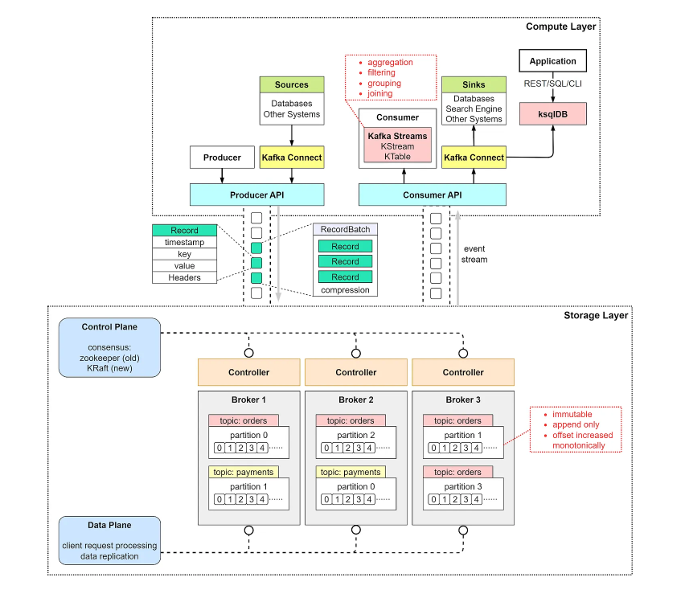

# Kafka With SpringBoot
Sanket Mohalkar

# Apache Kafka Overview

Apache Kafka is an open-source distributed event streaming platform used for building real-time data pipelines and streaming applications. It is designed to handle high-throughput, fault-tolerant, and scalable messaging.

## Key Terminology

- **Producer:** A client application that publishes (writes) records to Kafka topics.
- **Consumer:** A client application that subscribes to (reads) records from Kafka topics.
- **Topic:** A category or feed name to which records are sent by producers. Topics are partitioned for parallel processing.
- **Partition:** A single log within a topic where records are stored. Partitions enable scalability and fault-tolerance.
- **Broker:** A Kafka server that stores records and serves client requests. A Kafka cluster comprises multiple brokers.
- **Cluster:** A group of Kafka brokers working together to manage data and provide redundancy.
- **Zookeeper:** A centralized service for maintaining configuration information, naming, providing distributed synchronization, and group services within a Kafka cluster.
- **Offset:** A unique identifier assigned to each record within a partition, used by consumers to track their position.

## Kafka Architecture

Kafka's architecture is built around the following key components:

1. **Producers:** Producers send records to Kafka topics. Each record consists of a key, value, and optional headers. The key can be used to determine the partition to which the record will be sent.

2. **Topics and Partitions:** Topics are divided into partitions, which are the fundamental units of parallelism and scalability in Kafka. Each partition is an ordered, immutable sequence of records.

3. **Brokers:** Brokers are the Kafka servers that store data and serve client requests. Each broker hosts one or more partitions of a topic. Brokers communicate with each other to ensure data replication and fault tolerance.

4. **Consumers:** Consumers read records from Kafka topics. They can be organized into consumer groups, where each consumer in the group processes data from different partitions, enabling parallel data processing.

5. **Zookeeper:** Kafka relies on Zookeeper to manage the cluster metadata, including broker information, partition assignments, and configuration settings. Zookeeper ensures the coordination and synchronization of the Kafka cluster.


In this architecture:
- Producers publish records to brokers.
- Brokers store records in partitions and manage replication.
- Consumers read records from brokers, optionally as part of a consumer group.
- Zookeeper maintains the metadata and ensures coordination among brokers.





## Delivery Guarantees

Kafka provides three types of message delivery guarantees:
- **At Most Once:** Messages are delivered zero or one time.
- **At Least Once:** Messages are delivered one or more times.
- **Exactly Once:** Messages are delivered exactly once.

# Install and Setup on Windows

Follow these steps to install and set up your environment on Windows.

## Prerequisites

- Ensure you have Java installed on your system.
- Download and extract Kafka from the [official website](https://kafka.apache.org/downloads).

## Setting Windows Path in Environment Variables

1. Open the Start Menu and search for "Environment Variables."
2. Click on "Edit the system environment variables."
3. In the System Properties window, click the "Environment Variables" button.
4. In the Environment Variables window, under System variables, find and select the "Path" variable, then click "Edit."
5. Click "New" and add the path to the Kafka `bin` directory (e.g., `C:\Softwares\kafka\bin`).
6. Click "OK" to save the changes.

## Starting Zookeeper

To start the Zookeeper server :

1. Open a command prompt.
2. Run the following command to start Zookeeper:
    ```sh
    zookeeper-server-start C:\Softwares\kafka\config\zookeeper.properties
    ```

## Starting Kafka

To start the Kafka server :

1. Open a new command prompt.
2. Run the following command to start Kafka:
    ```sh
    kafka-server-start C:\Softwares\kafka\config\server.properties
    ```

Now your Kafka environment should be up and running on your Windows machine!


# Kafka Command Line Operations

This document provides a quick reference for basic Kafka command line operations, including listing topics, creating a topic, describing a topic, producing and consuming messages, and deleting a topic.

## List Topics

To list all the topics:

1. 
    ```sh
    kafka-topics --list --bootstrap-server localhost:9092
    ```

## Create Topic

To create a new topic :

1. 
    ```sh
    kafka-topics --create --replication-factor 1 --partitions 1 --topic first-topic --bootstrap-server localhost:9092
    ```
   
    This command will create a topic named `first-topic` with a replication factor of 1 and 1 partition.

## Describe Topic

To describe the properties of the topic `first-topic` :

1. 
    ```sh
    kafka-topics --describe --topic first-topic --bootstrap-server localhost:9092
    ```

## Produce Messages

To produce messages to the topic `first-topic` :

1. 
    ```sh
    kafka-console-producer --broker-list localhost:9092 --topic first-topic
    ```
   
    After running the above command, type your message and press `Enter`. For example:
   
    ```
    > Hello Kafka
    ```

## Consume Messages

To consume messages from the topic `first-topic` :

1. 
    ```sh
    kafka-console-consumer --bootstrap-server localhost:9092 --topic first-topic
    ```

## Delete Topic

To delete the topic `first-topic` :

1. 
    ```sh
    kafka-topics --delete --bootstrap-server localhost:9092 --topic first-topic
    ```

**Note:** If the delete command does not work, you might need to enable topic deletion in the server properties. Add the following line to your `server.properties` file:

```properties
delete.topic.enable=true


